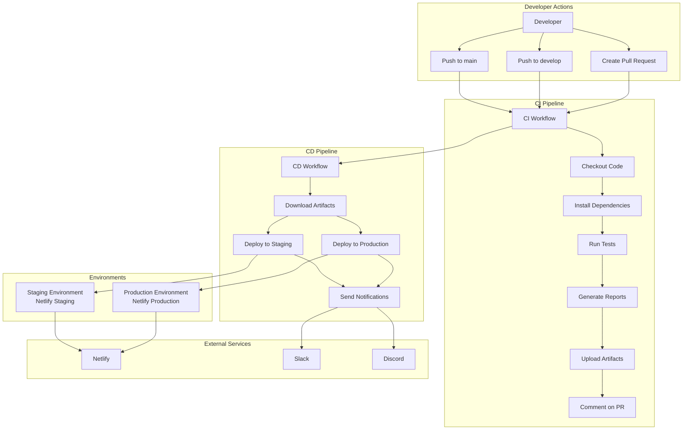

# CI/CD Architecture

This document describes the architecture of the CI/CD pipeline for the SwagLabs Test Automation project.

## Overview

The project implements a modern CI/CD pipeline using GitHub Actions with separate CI and CD workflows, supporting multiple environments and deployment strategies.

## Architecture Diagram



## Workflow Components

### CI Workflow (`ci.yml`)

**Purpose:** Continuous Integration - Build, test, and generate reports

**Components:**
- Code checkout
- Dependency installation
- Test execution
- Report generation
- Artifact management
- PR integration

**Outputs:**
- Test results
- Allure reports
- Screenshots
- Artifacts

**Triggers:**
- Push to `main` or `develop`
- Pull requests
- Manual trigger (via `workflow_call`)

### CD Workflow (`deploy-report.yml`)

**Purpose:** Continuous Deployment - Deploy reports to environments

**Components:**
- Artifact download
- Environment-specific deployment
- Notification system

**Environments:**
- **Staging**: Auto-deploy from `develop`
- **Production**: Auto-deploy from `main` (with optional approval)

**Triggers:**
- After CI workflow completes
- Manual trigger with environment selection

### Rollback Workflow (`rollback.yml`)

**Purpose:** Rollback deployments to previous versions

**Components:**
- Deployment history retrieval
- Deployment restoration
- Rollback notifications

**Environments:**
- Staging rollback
- Production rollback (with approval)

**Triggers:**
- Manual trigger only (for safety)

## Data Flow

### Normal Deployment Flow

```
1. Developer pushes code
   ↓
2. CI workflow triggered
   ↓
3. Tests run and reports generated
   ↓
4. Artifacts uploaded
   ↓
5. CD workflow triggered (if CI succeeds)
   ↓
6. Artifacts downloaded
   ↓
7. Deploy to appropriate environment
   ↓
8. Notifications sent
```

### Rollback Flow

```
1. Issue detected
   ↓
2. Manual rollback triggered
   ↓
3. Deployment history retrieved
   ↓
4. Previous deployment restored
   ↓
5. Rollback notifications sent
```

## Environment Strategy

### Staging Environment

- **Purpose:** Testing deployments before production
- **Branch:** `develop`
- **Deployment:** Automatic after successful CI
- **Approval:** Not required
- **URL:** `https://<staging-site-id>.netlify.app`

### Production Environment

- **Purpose:** Live production reports
- **Branch:** `main`
- **Deployment:** Automatic after successful CI
- **Approval:** Optional (configurable)
- **URL:** `https://<production-site-id>.netlify.app`

## Security

### Secrets Management

Secrets are stored in GitHub Secrets:
- `NETLIFY_AUTH_TOKEN`: Netlify authentication
- `NETLIFY_SITE_ID`: Production site identifier
- `NETLIFY_STAGING_SITE_ID`: Staging site identifier
- `SLACK_WEBHOOK_URL`: Slack notifications (optional)
- `DISCORD_WEBHOOK_URL`: Discord notifications (optional)

### Access Control

- **Environments:** Can require reviewers for production
- **Workflows:** Repository-level permissions
- **Secrets:** Encrypted and only accessible to workflows

## Notification System

### Channels

1. **GitHub Actions Summary**
   - Always available
   - Shows in workflow run

2. **Slack** (Optional)
   - Webhook-based
   - Rich formatting
   - Action buttons

3. **Discord** (Optional)
   - Webhook-based
   - Embed formatting
   - Timestamps

### Notification Events

- Deployment success
- Deployment failure
- Rollback success
- Rollback failure

## Deployment Strategies

### Current Strategy: Direct Deployment

- Deploy directly to target environment
- No blue-green or canary deployments
- Suitable for static report deployments

### Future Enhancements

- Blue-green deployment for zero-downtime
- Canary deployment for gradual rollout
- Health checks before switching traffic

## Monitoring

### Deployment Monitoring

- GitHub Actions workflow status
- Netlify deployment dashboard
- Notification channels

### Health Checks

- Deployment status verification
- URL accessibility checks
- Report generation validation

## Scalability

### Current Limitations

- Single deployment at a time
- Sequential workflow execution
- Manual rollback process

### Future Improvements

- Parallel deployments
- Automated health checks
- Automatic rollback on failure
- Deployment history tracking

## Best Practices

1. **Separate CI and CD**: Clear separation of concerns
2. **Environment Isolation**: Separate staging and production
3. **Manual Rollback**: Safety mechanism for production
4. **Notifications**: Keep team informed
5. **Documentation**: Comprehensive guides

## Related Documentation

- [Deployment Guide](DEPLOYMENT_GUIDE.md)
- [Rollback Guide](ROLLBACK_GUIDE.md)
- [Troubleshooting Guide](TROUBLESHOOTING.md)

